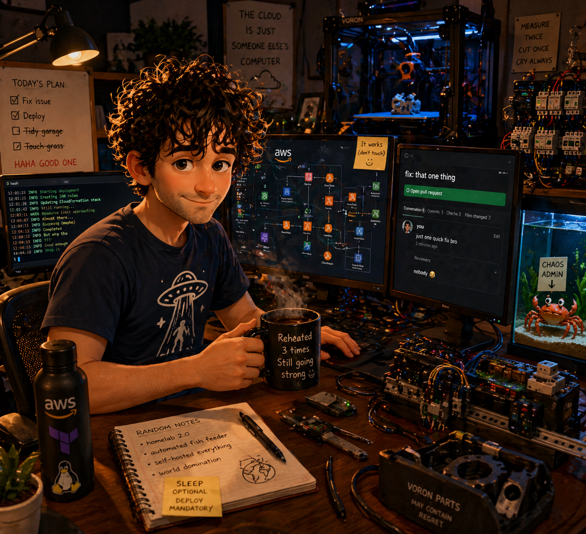

<table>
<tr>
<td width="60%" valign="top">

## Platform Engineer • Cloud Builder • Professional Over-Engineer

Hey — I’m Gareth.

I’m a platform engineer who spends most of my time building scalable cloud infrastructure, automating everything I can get my hands on, and accidentally turning "quick side projects" into full-blown systems.

My world mostly revolves around:

- ☁️ AWS & serverless architecture
- 🤖 AI engineering, LLM tooling & agent systems
- 🧠 AWS Bedrock, FastMCP, Langfuse & AI observability
- ⚙️ Platform engineering & infrastructure automation
- 🐍 Python, Bash & Go
- 🏠 Home Assistant & smart home chaos
- 🖨️ 3D printing & DIY projects
- 🔌 Homelab experiments that probably didn’t need Kubernetes
- 🐠 Aquariums, electronics, and things with way too many cables

I enjoy designing systems that are reliable, observable, and maintainable — while still being practical enough to ship quickly.

When I’m not working, there’s a good chance I’m:

- rebuilding something that already worked perfectly fine
- printing replacement parts for printers printing replacement parts
- automating my house for no reason other than "because I can"
- staring at Datadog logs pretending it’s debugging and not archaeology

---

### Tech I Use Often

```text
AWS • Terraform • Docker • Kubernetes • Python
Go • Bash • GitHub Actions • Linux • Home Assistant • FluxCD
Datadog • Prometheus • PostgreSQL • Serverless • Klipper
```

</td>
<td width="40%" align="center" valign="top">



<br/><br/>

_Disturbingly accurate cartoon version of me courtesy of ChatGPT._

</td>
</tr>
</table>

